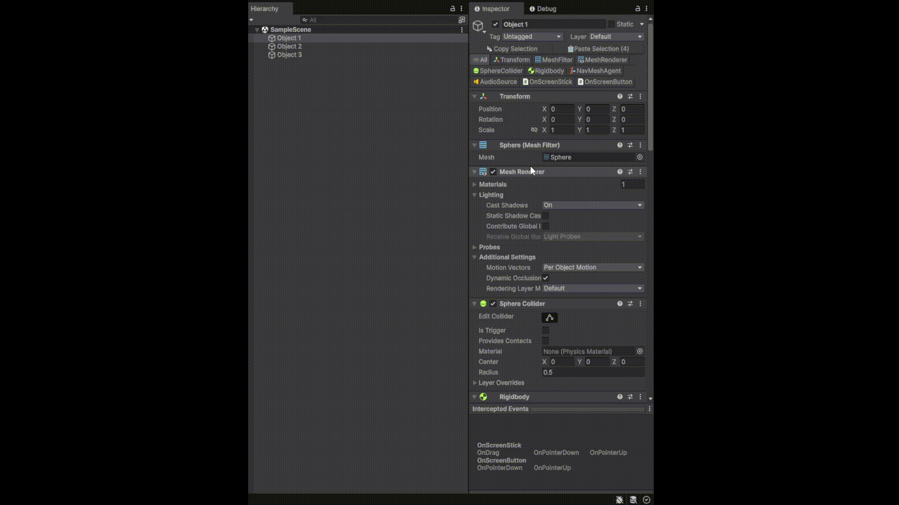
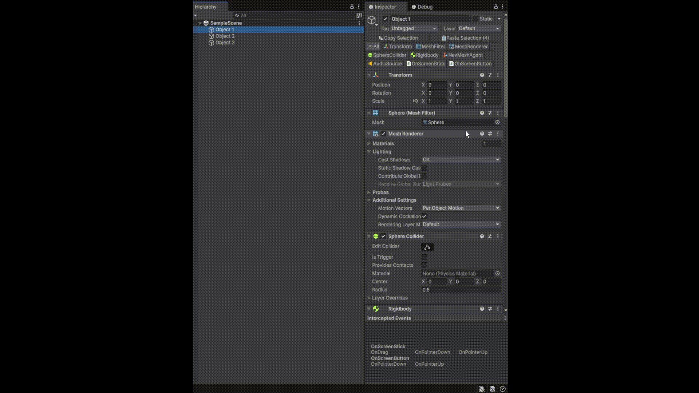
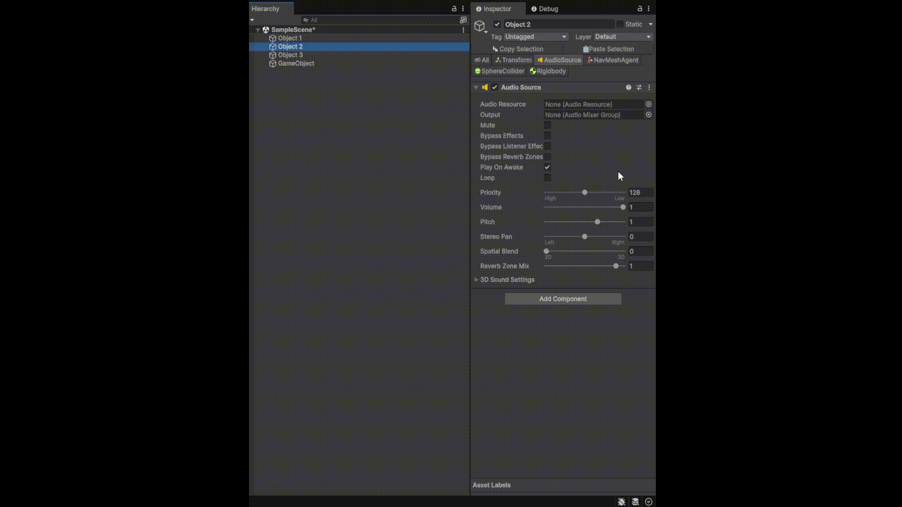

# Sidekick-Inspector

A lightweight Unity **Editor extension** that adds a custom control to the **Inspector header**, allowing you to **isolate individual components** on a GameObject by toggling their visibility.  
This tool is designed to improve Inspector readability and workflow efficiency, especially when working with GameObjects that contain many components.

---

## ✨ Features

### Component Isolation
- Toggle individual components **on/off** directly from the Inspector header.
- Hidden components are visually suppressed without being removed or disabled.
- Isolation state **persists when reselecting GameObjects** (not reset on reselection).

### Copy & Paste Components
- Copy components **based on isolation state**:
  - Copy only visible (isolated) components.
  - Copy by value (field data preserved).
- Paste options:
  - Paste as **new component**
  - Paste by **overwriting existing component**
  - Paste onto a **different GameObject**
- Supports **multiple component copy** in a single operation.

### Multi-Object Support
- Works with **multiple GameObject selection**.
- Copy and paste components across multiple selected objects consistently.

---
## 📷 Demo

| <br><sub>Isolate individual components in the Inspector</sub> | <br><sub>Works with multi-object selection</sub> | <br><sub>Copy & paste isolated components</sub> |
|----|----|----|

---

## 📦 Installation (via Git URL)

You can import this tool directly using Unity Package Manager.

### Steps
1. Open your Unity project.
2. Go to **Window → Package Manager**
3. Click the **“+”** button (top-left).
4. Select **“Add package from git URL…”**
5. Paste your repository URL:
```
https://github.com/kanbarudesu/Sidekick-Inspector
```

## 🎯 Use Cases

- Working with complex prefabs that contain many components
- Quickly comparing or transferring component setups
- Cleaner Inspector view without disabling components
- Batch editing across multiple GameObjects